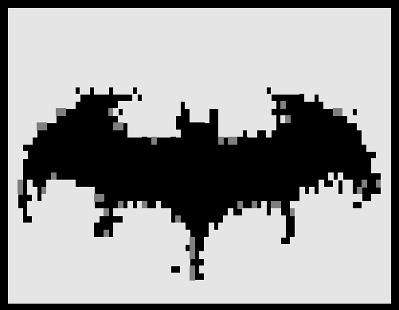

<table border="0">
  <tr>
    <td width="42%" align="center">
      
    </td>
    <td width="58%">
      <h1 align="center">
        Hi, I'm <a href="https://github.com/Subhasish18" target="_blank">Subhasish Das!</a>
      </h1>
      

        <b>Location:</b> Kolkata, India 
        <b>Education:</b> B.Tech in CSE (AI & ML) 
        <b>College:</b> SurTech 
        <b>Graduation:</b> 2026
      

    </td>
  </tr>
</table>

<h2>
  &nbsp;
  <u><b>About Me</b></u>
</h2>

  I am a <b>Computer Science Engineering graduate with a specialisation in AI & ML</b>,
  now focused on becoming an <b>AI Engineer</b>. I am building my skills in machine
  learning, deep learning, generative AI, LLMs, RAG systems, and AI-powered applications.

  My goal is to strengthen my problem-solving ability and develop practical AI systems
  that are useful, reliable, and creative. I enjoy learning new technologies,
  experimenting with intelligent systems, and turning ideas into real projects.

- 🚀 I’m eager to join new projects.
  
- Outside tech, I enjoy socialising with friends, 🎮 playing video games, 🎵 listening to music, 🦾 weight-lifting, watching sports, and I also love 🏍️ driving motorcycles and cars.
  
- 📫 Reach out to me at: <a href="subhasish16das@gmail.com">subhasish16das@gmail.com</a>

<h2>
  
  <u><b>Socials</b></u>
</h2>

  
  
  
  
  
  
  

 

&nbsp; ***Skills***

###### Languages & Syntax:
&nbsp;
&nbsp;

###### Frontend Development:
&nbsp;
&nbsp;

&nbsp;

###### Backend & Frameworks:
&nbsp;

###### Deployment & Cloud Services:
&nbsp;
 

#### ML/DL:

 ###### Database Management:
&nbsp;
&nbsp;
 

###### Development Tools:
&nbsp;
&nbsp;

&nbsp;

&nbsp;

###### Development Environments:
&nbsp;
&nbsp;
&nbsp;

 

<h2>
  
  <u><b>GitHub Stats</b></u>
</h2>

  

<h3>
  🔝 <u><b>Top Contributed Repo</b></u>
</h3>

  

  

<h2 align="center"> Thanks for visiting my profile. </h2>

